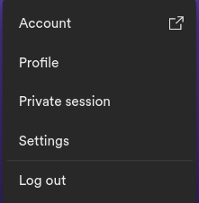

# spotify-recommender

- [Use Case](#use-case)
- [Setup](#setup)
- [Methods](#methods)
- [Packages used](#packages-used)
- [OG Scripts](#og-scripts)

## Use Case
 - This is the first section of this readme, because, you will see, this package can help, but nothing is perfect, so it will, as long as you fit in this very very particular use case ;(
 - The perfect use case for this is that one playlist (or more) that you put a bunch of songs in different times and mood styles, and when you listen to it, you feel like only listening to a part of it, some days later, that part is useless, but some other part is awesome. The big issue here is that those "parts" are shuffled all over the playlist. Then how would one find those songs that they are craving, today, tomorrow, and later? Speaking from experience, it is not worth it to map manually a 1000 song playlist and filter out 50, or 100.
 - This package comes to solve this issue, roughly, because it tries to find the K (number of songs in the new recommendation playlist) nearest songs in terms of genres, artists and popuarity, using the KNN supervised machine learning technique
 - One issue with this is that spotify api is not the best, E.g. A LOT of artists do not have any gender associated to them
 - Other issue is that spotify api does not provide, at the time of publish of version 2.1.2, neither song nor album genres, which compromise a good portion of the accuracy of the recommendations, still i recommend you give it a try

## Setup

### Requirements:
  - Python installed 
 The ideal version, to run the package is 3.8.x, the version in which the package was built over,  however,
 older versions of python 3 shouldn't have any issues, as the package does not use any   
 fancy, new methods, not supported by older versions of Python 3.x
  - Network Connection 
 So that a wide range of songs can be analised, it is imperative to have a network connection, at least for the first time executing a script using this package
  - <strong>A fitting playlist</strong> 
 The perfect use case for this package is that of one big playlist (500+ songs), which you feel like listening to some of them, then others but never all of them
 Still, in the first versions of this package, this playlist will have to have at least two of your favorite songs.
  - ## <strong>Patience</strong>
    It may seem funny or a joke, but the first mapping process of the playlist to a local pandas DataFrame, it will take a good while, up to 2.5 to 3 second per song, at 20-40Mbps Internet connection, being in Latam. All these factors play a part in the time for it to load.
    Just to make it clear, cpu, ram, these will not help much, the issue is to have up to 5 different http requests per song, which make this take so long
  - Jupyter Notebook 
 Not exactly a requirement but it is advised that a jupyter notebook is used ( even more advised to use the vscode extension for jupyter notebooks ), because it is important, or at least more confortable, to have the variable still in memory and then decide how to use it, without having to run the script multiple times
  - Spotify access 
 I mean, you know thJsonat already, right?

  - Installing the package 
~~~ps1
pip install spotify-recommender-api
~~~

  - Importing the package 

Firstly, it's necessary to import the method start_api from the package spotify_recommender.api:
 ~~~ python
 from spotify_recommender_api.recommender import start_api
 ~~~

### Starting the api
  - Gathering the initial information: (playlist_url, user_id) 
  
  --- Playlist URL: The playlist url is available when right clicking the playlist name / or going to the three dots that represent the playlist options  
  --- Playlist ID: The playlist id is available the hash string between the last '/' in and the '?' in the playlist url 
   
  --- User ID: The use rid is available when clicking the account, and accessing its information, on spotify's website 
   
  
  - Calling the function:
~~~python
api = start_api(playlist_url='<PLAYLIST_URL>', user_id='<USER_ID>')
~~~
Or
~~~python
api = start_api(playlist_id='<PLAYLIST_ID>', user_id='<USER_ID>')
~~~
Though, to be honest, it is easier and more convenient to use the playlist URL

  - Getting the Auth Token:
  It is a hash token that expires 60 minutes after it is generated, first you need to say that you want to be redirected (y)
  But if it is not the first time you are executing the script in less than an hour, then press(n) and paste the token  
  Otherwise press "Get Token", and then select the 5 scope options: 
  
   
  
  Then request it, after that hit crtl+A / command+A to select it all then crtl+C / command+C to copy it
  Then, back to python, paste it in the field requiring it and press enter
  Then if you already have a previously generated CSV file format playlist, type csv then enter, if you do not have the playlist as previously generated, press web, but know that it will take a good while as said [here](#patience),and if this is the case, go get a coffee, or tea if you are into that sort of thing.
  
  
## Methods
 - get_playlist
~~~python
# Method Use Example
api.get_playlist()
# Function that returns the pandas DataFrame representing the base playlist
~~~ 
 - playlist_to_csv
~~~python
# Method Use Example
api.playlist_to_csv()
# Function that creates a csv format file containing the items in the playlist
# Especially useful when re running the script without having changed the playlist
~~~ 
 - get_medium_term_favorites_playlist
~~~python
# Parameters
get_medium_term_favorites_playlist(with_distance: bool, generate_csv: bool, generate_parquet: bool, build_playlist: bool)
# Method Use Example
api.get_medium_term_favorites_playlist(generate_csv=True, build_playlist=True)
# Function that returns the pandas DataFrame representing the 
# medium term top 5 recommendation playlist
# All parameters are defaulted to False
# The "distance" is a mathematical value with no explicit units, that is 
# used by te algorithm to find the closest songs
# build_playlist will change the user's library
~~~ 
 - get_short_term_favorites_playlist
~~~python
# Parameters
get_short_term_favorites_playlist(with_distance: bool, generate_csv: bool, generate_parquet: bool, build_playlist: bool)
# Method Use Example
api.get_short_term_favorites_playlist(generate_csv=True, build_playlist=True)
# Function that returns the pandas DataFrame representing the 
# short term top 5 recommendation playlist
# All parameters are defaulted to False
# The "distance" is a mathematical value with no explicit units, that is 
# used by te algorithm to find the closest songs
# build_playlist will change the user's library
~~~ 
 - get_recommendations_for_song
~~~python
# Parameters
get_recommendations_for_song(song: str, K: int, with_distance: bool, generate_csv: bool, generate_parquet: bool, build_playlist: bool, print_base_caracteristics: bool)
# Method Use Example
api.get_recommendations_for_song(song='<SONG_NAME>', K=50)
# Function that creates returns the pandas DataFrame representing the 
# given song recommendation playlist
# the 'song' and 'K' parameters are mandatory and the rest is
# defaulted to False
# The "distance" is a mathematical value with no explicit units, that is 
# used by te algorithm to find the closest songs
# print_base_caracteristics will display the parameter song information
# build_playlist will change the user's library
~~~ 

## OG Scripts
### Context
This script, in jupyter notebook format for organization purposes, applies the technique called K Nearest Neighbors to find the 50 closest songs to either one chosen or one of the users top 5(short term), all within a specific Spotify playlist, in order to maintain the most consistency in terms of the specific chosen style, and creates a new playlist with those songs in the user's library, using their genres, artists and overall popularity as metrics to determine indexes of comparison between songs

### Variations
There are also 2 variations from that, which consist of medium term favorites related top 100 and "short term top 5" related top 50 songs. They vary from OG model since the base song(s) is(are) not chosen by hand but statistically

### DISCLAIMER ###
Not fit for direct use since some information such as client id, client secret, both of which are, now, in a hidden script on .gitignore so that it is not made public, have to be informed in order for the Spotify Web API to work properly.
And also, these scripJsonts are deprecated, so they will not have any maintenance or overtime improvements

## Packages used
 - Pandas 
~~~ps1
pip install pandas
~~~
 - Requests
~~~ps1
pip install requests
~~~
 - Webbrowser (webbrowser)
 - Json (json)
 - Operator (operator)
 - Functools (functools)
 - Os (os)
